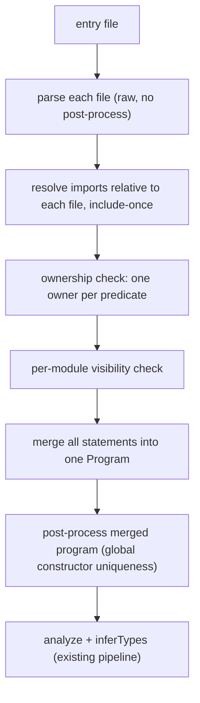

# Design proposal: a module/import system for Datamog

Status: proposal (nothing implemented yet).

This is the conservative design. For the ambitious alternative that treats a
program as a function from input relations to output relations, see
[`imports-as-functors.md`](./imports-as-functors.md).

Datamog programs are single files today. This proposes a small module system so
larger programs can be split across files, with a clear path to grow into
reusable libraries later. It covers what we call the two use cases:

1. **Split a program.** One large program broken into several files that
   reference each other. This is the immediate goal.
2. **Reusable libraries.** Generic, parameterisable units reused across
   programs (Soufflé-style components, ML functors). Out of scope for the first
   version, but the design leaves room for it.

## Summary of the model

- A **module is a file**. Its resolved absolute path is its identity.
- A predicate is **owned** by the one module that declares it (`extensional`) or
  defines it (has rules for it). Exactly one owner.
- A module lists what it offers with `export`. A module states what it depends on
  with `import "path"`, which is resolved relative to the importing file.
- Importing a module makes its **exported** predicates visible under their own
  names. You may use them in rule bodies and queries. You may not add rules for
  them or redeclare them (no cross-file extension).
- Everything is checked, then merged into one program, then analysed and solved
  by the existing pipeline. Recursion and stratification stay global, so
  cross-file mutual recursion works.

These are the four decisions taken up front:

1. EDB data for a module's `extensional` predicates resolves relative to **that
   module's own directory**.
2. Global checks (constructor-name uniqueness in particular) run on the **merged**
   program.
3. **No cross-file extension**: a predicate has one owning file; a second file
   cannot add rules for it or redeclare it.
4. Import is a **statement**, not a preprocessor directive.

## Syntax

```prolog
# lib/graph.dl
export edge, path.

extensional edge(src: integer, dst: integer).

path(X, Y) :- edge(X, Y).
path(X, Z) :- path(X, Y), edge(Y, Z).
```

```prolog
# main.dl
import "lib/graph.dl" (path).

# `path` is visible here because we imported it by name from graph.dl.
reachable_from_1(X) :- path(1, X).

?- reachable_from_1(X).
```

`edge`'s data is read from `lib/edge.csv` (next to `lib/graph.dl`), not from
`main.dl`'s directory. That is decision 1.

An `export` names predicates the module owns. Multiple `export` statements
accumulate; convention is to put them at the top. An `import` names a file;
convention is likewise the top of the file, but both are plain statements and
their order does not matter (a module's imports and exports form sets).

### Grammar additions

`Statement` gains two alternatives (`packages/parser/src/datamog.langium`):

```langium
Statement:
    ExtDecl | Rule | Query | Import | Export;

Import:
    'import' path=STRING '(' names+=Identifier (',' names+=Identifier)* ')' '.';

Export:
    'export' names+=Identifier (',' names+=Identifier)* '.';
```

An `import` names a file and the predicates to bring in from it, each of which
must be exported by that file. The `as` slot for aliasing is added later,
alongside the qualified-name machinery it needs (see *Extending to use case 2*);
adding it will not break existing `import "path" (names) .` programs. `import`
and `export` become reserved keywords (add them to `RESERVED_KEYWORDS` in
`packages/core/src/keywords.ts` alongside the grammar change; add `as` when
aliasing lands).

## Semantics

### Ownership and visibility

- **Owner.** A predicate is owned by the module that declares it `extensional`
  or writes rules for it. Declaring the same EDB in two modules, or writing
  rules for the same predicate name in two modules, is an error. This is
  decision 3, and it is the multi-file analogue of the REPL's existing "defined
  in an earlier chunk and cannot be extended" rule
  (`packages/engine/src/incremental.ts`).
- **Export must be owned.** A module can only export a predicate it owns.
- **Visible set of a module M** = predicates M owns, plus the predicates M names
  in its `import` statements. Each imported name must be exported by the module
  it is imported from, otherwise it is an error ("module `graph.dl` does not
  export `p`").
- **Reference check.** Every predicate referenced in a rule body or query in M
  must be in M's visible set. A name that exists elsewhere in the merged program
  but is neither owned by M nor imported into M is an error, reported at M's
  source position ("`p` is not visible here; import it by name from the module
  that exports it").
  This per-module check is what makes imports explicit rather than a flat
  textual include.

### Non-transitive imports

Imports do not chain. If A imports B and B imports C, A does not see C's exports;
A must import C itself to use C's predicates. This is the more explicit choice
and matches Haskell, Rust, and Prolog module semantics. The cost is a little
repetition when several files share a common module, which is the standard
trade for explicitness. (Re-export, listed under extensions, is the escape
hatch when that repetition becomes annoying.)

### Collisions

Because ownership is global and unique, two visible predicates with the same
name are necessarily different predicates, so a name that resolves to two owners
in module M is an ambiguity error in M (for example, importing two modules that
both export `path`, or importing `path` while also owning a local `path`). The
first version has no way to disambiguate; the fix is to rename, or to use an
alias once aliasing lands. We report the clash rather than silently unioning.

### Recursion vs extension

These are different and only extension is forbidden:

- **Cross-file recursion** is fine. If `p` in A calls exported `q` in B, and `q`
  calls exported `p` back, merging the two modules yields one program where
  `{p, q}` is a recursive component solved globally. Nothing special is needed.
- **Cross-file extension** is the error: two modules both writing rules for `p`.

### Cyclic imports

Module import cycles are allowed. Loading is include-once keyed by resolved
absolute path, which terminates the walk. Combined with merge-then-solve, a
cycle of imports is not a problem the way it is in languages with ordered,
side-effecting module initialisation.

## Resolution and linking pipeline



1. Parse the entry file. Collect its `import` targets.
2. Resolve each target relative to the importing file's directory; canonicalise
   to an absolute path. If already loaded, reuse; otherwise read and recurse.
3. For each module record: absolute path, directory, statements (with `import`
   and `export` removed), export set, resolved import set, owned-predicate set.
4. Ownership check (step 3 of the model).
5. Visibility check per module.
6. Merge every module's statements into one `Program`, stamping each statement
   with its source module for diagnostics (see below).
7. Post-process the merged program once, then `analyze` + `inferTypes` as today.
8. Bind each EDB predicate to its owning module's directory for loading.

### Why parse raw, then post-process the merged program

`parse()` currently runs `postProcess` on every call, and post-processing
enforces the program-global constructor-name uniqueness check plus its
synthetic-name counters. To make that check see the whole program (decision 2),
the resolver must parse each file into a raw AST and post-process **once** on the
merged program. This needs a small parser addition: a parse entry that skips
post-processing (or an exposed `postProcessProgram(merged)` the resolver calls
after merging). Both are pure and browser-safe, so they stay in
`packages/parser` with no filesystem dependency.

(Post-processing per file and then re-checking only constructor uniqueness on
the merged set is a possible shortcut, but running post-process once on the
merged program is cleaner and keeps a single synthetic-name counter space.)

### Reading files: an injectable resolver

The parser deliberately runs on `EmptyFileSystem` and is browser-safe, so file
reading must not live there. Model the resolver as a small injectable interface,
mirroring the existing `ExtensionalLoader` pattern:

```ts
interface ModuleResolver {
  // Absolute path of `importPath` as written in `fromPath`.
  resolve(fromPath: string, importPath: string): string;
  // Source text of a resolved module path.
  read(absPath: string): Promise<string>;
}
```

- CLI supplies a Bun-based resolver (`Bun.file`, `node:path`), mirroring the
  single existing program read in `packages/cli/src/main.ts`.
- The playground supplies an in-memory resolver over its per-file source map.
- The VS Code extension supplies a `node:fs` resolver (it already reads sibling
  files in `src/disk-loader.ts`).

This keeps imports working across all three hosts without dragging a filesystem
into the parser or the browser bundle.

### EDB data per module (decision 1)

Loaders currently take one `directory` and bind predicate `p` to `p.csv` in it
(`packages/engine/src/directory-loader.ts`). With modules, each EDB predicate
loads from its **owner module's** directory. The resolver builds a
`Map<predicate, ownerDirectory>` and the directory loaders consult it (or the
resolver constructs one loader instance per module directory). Explicit input
flags (`--<input> source`, or `--input name=source`) still override by predicate
name as they do now.

### Diagnostics across files

AST node positions (`$cstNode`) are offsets into a single source string with no
source identity. After merging statements from several files, an analyser error
must know which file a node came from. The minimal fix is a side table
`Map<Statement, { path, source }>` populated at merge time; error rendering
walks from the offending node up to its containing statement to find the module,
then maps the offset to `file:line`. This is the one genuinely new piece of
plumbing; it does not require adopting Langium's full document/workspace model.

## Touch points by package

- **parser**: grammar (`Import`, `Export`); `keywords.ts` (`import`, `export`);
  a raw-parse entry or exposed `postProcessProgram` so post-processing runs on
  the merged program.
- **core**: re-export `Import`/`Export` AST types; a new link/visibility pass
  (ownership + per-module visibility + collision checks) that runs before the
  existing `analyze`. `analyze` itself keeps working on the merged flat
  `Program`; its existing "predicate not defined" error still covers genuinely
  undefined names in a single-file program.
- **engine**: an executor entry that takes an entry path plus a `ModuleResolver`,
  runs the link/merge, then the existing translate/execute pipeline on the merged
  program. The current `execute(source)` string entry stays for single-file runs
  and the REPL. Per-module EDB directory binding in the loader path.
- **cli**: use the resolver entry when the program has imports; supply the
  Bun resolver and per-module data directories.
- **repl / incremental, playground, vscode**: follow-ups (see non-goals).

## Extending to use case 2

The first version's foundations (export lists, single-owner module identity, an
injectable resolver, a link pass separate from analysis) are what the library
features build on. Each of these is additive:

1. **Whole-module import**: allow a bare `import "graph.dl".` with no name list
   to bring in all of the module's exports, as a convenience once a file imports
   most of what a module offers. The first version requires the explicit name
   list.
2. **Aliased / qualified import**: `import "graph.dl" as g.` then `g.path`. This
   needs qualified references in the grammar and a predicate-identity layer that
   maps a module-qualified name to a unique SQL identifier (for example
   `g__path`), because two aliases of one module, or two instances of a functor,
   yield distinct predicates that share a base name. The first version keeps
   identity equal to the bare name (single owner, no mangling), and this is the
   point where mangling slots in.
3. **Re-export**: allow an `export` to name an imported predicate, forwarding it.
   This relaxes non-transitive imports where a module wants to present a curated
   surface built from its dependencies.
4. **Parameterised modules (components / functors)**: a module parameterised over
   some of its predicates, instantiated by binding them to concrete predicates.

   ```prolog
   # reach.dl — edge is a parameter, not owned here
   module Reach(edge).
   export reach.
   reach(X, Y) :- edge(X, Y).
   reach(X, Z) :- reach(X, Y), edge(Y, Z).
   ```

   ```prolog
   import "reach.dl" as roads   with edge = road.
   import "reach.dl" as flights with edge = airline.
   ```

   Each instantiation is a fresh copy of the module's owned predicates with
   mangled identities (`roads__reach`, `flights__reach`) and the parameter bound
   to the supplied predicate. This reuses the identity layer from step 2 and is
   the largest jump; it is explicitly out of scope for the first version.

## Non-goals for the first version

- Aliasing, selective import, re-export, parameterised modules (the four above).
- `import` inside the REPL. The incremental session's redefinition lock and the
  per-chunk merge interact with imports and need their own design pass.
- Playground and VS Code virtual resolvers. The `ModuleResolver` interface is
  designed to allow them, but wiring is a follow-up.
- Search paths, a bundled standard library, or a package registry. Relative
  paths only.

## Open choices (defaults chosen, easy to flip)

These are judgment calls, not forced by the four decisions:

- **Name-level imports as the default.** `import "graph.dl" (path).` names each
  predicate brought in, so both the module's offered surface (`export`) and each
  dependency at its use site are explicit. A bare `import "graph.dl".` pulling
  all exports is an easy later convenience (see *Extending to use case 2*).
- **Non-transitive imports.** More explicit, standard, matches the preference for
  explicit imports/exports. Costs a little repetition for shared modules.
- **Collisions are errors.** No implicit qualification; rename, or alias once
  aliasing lands.
