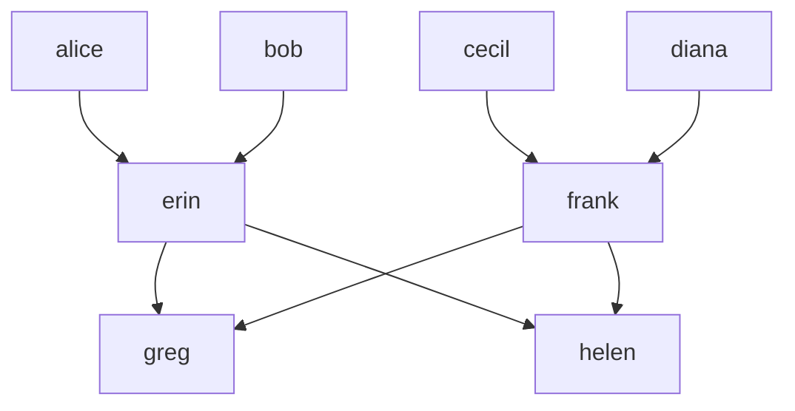

# Chapter 2 — Rules, variables, and joins

In Chapter 1 we stored facts and queried them. That's already useful,
but it's not much more than a slightly austere spreadsheet. In this
chapter we give Datalog its first bit of reasoning power: **rules**.

A rule lets us define a new predicate in terms of ones we already
have. When the body of a rule mentions the same variable in two
places, that shared variable is a **join**. By the end of this
chapter you should be able to read a Datalog rule and see the SQL
join it corresponds to — and write your own rules from scratch.

## A three-generation family

Our running dataset for this chapter is a small family tree, stored
in [`code/ch02/parent.csv`](code/ch02/parent.csv):

```
parent_name,child_name
alice,erin
bob,erin
cecil,frank
diana,frank
erin,greg
erin,helen
frank,greg
frank,helen
```

Drawn as a picture (edges point from parent to child):



(If you're curious: this Mermaid source is identical to what Datamog's
built-in Mermaid loader would read. Save it as `parent.mmd` alongside
a `.dl` file declaring `extensional parent(parent_name: string,
child_name: string).` and you get the same eight facts as the CSV.)

Four people at the top, two in the middle, two at the bottom.
Nothing clever; just enough structure to play with.

## Your first rule

Open [`code/ch02/family.dl`](code/ch02/family.dl). Along with the
now-familiar `extensional` declaration, you'll see:

```prolog
has_a_parent(C) :- parent(_, C).
```

This is a **rule**. Read the `:-` as "if". In English:

> `C` has a parent, if there is someone — we don't care who — whose
> child is `C`.

On the left of `:-` is the **rule head** (the new predicate we're
defining); on the right, the **rule body** (what must hold for the
head to be true).

The head predicate `has_a_parent` is new; we're not loading it from
anywhere, and we haven't declared it with `extensional`. It is an
**intensional** predicate — defined by rules rather than by data.

### Seeing a predicate's results

Defining a predicate does not, on its own, print anything. A program
reports two kinds of **output**:

- The single `?-` **query** you met in Chapter 1. A file has at most one,
  and it is the program's *default output*.
- Any number of **named outputs**. Prefix a rule with `output predicate`
  and, when the program runs, that predicate's whole relation is printed
  under its name.

`family.dl` marks `has_a_parent` as an output so we can watch it fill up:

```prolog
output predicate has_a_parent(C) :- parent(_, C).
```

Run the program:

```bash
bun run datamog doc/walkthrough/code/ch02/family.dl
```

and you'll see that `has_a_parent` contains `erin`, `frank`, `greg`,
`helen` — everyone in our data who appears in the second column of
`parent`.

**[Open this program in the playground →](https://max-schaefer.github.io/datamog/#p=parent(%22alice%22%2C%20%22erin%22).%0Aparent(%22bob%22%2C%20%22erin%22).%0Aparent(%22cecil%22%2C%20%22frank%22).%0Aparent(%22diana%22%2C%20%22frank%22).%0Aparent(%22erin%22%2C%20%22greg%22).%0Aparent(%22erin%22%2C%20%22helen%22).%0Aparent(%22frank%22%2C%20%22greg%22).%0Aparent(%22frank%22%2C%20%22helen%22).%0A%23%20Tutorial%2C%20chapter%202%20%E2%80%94%20rules%2C%20variables%2C%20and%20joins.%0A%23%0A%23%20A%20tiny%20three-generation%20family%3A%0A%23%0A%23%20%20%20alice%20%20%20bob%20%20%20%20%20%20cecil%20%20%20diana%0A%23%20%20%20%20%20%20%20%5C%20%20%2F%20%20%20%20%20%20%20%20%20%20%20%20%20%20%5C%20%20%2F%0A%23%20%20%20%20%20%20%20erin%20------------%20frank%0A%23%20%20%20%20%20%20%20%20%20%20%20%20%20%20%2F%20%20%20%20%20%20%5C%0A%23%20%20%20%20%20%20%20%20%20%20%20greg%20%20%20%20%20helen%0A%23%0A%23%20%60parent(X%2C%20Y)%60%20means%20%22X%20is%20a%20parent%20of%20Y%22.%20Data%20loads%20from%0A%23%20parent.csv%20next%20to%20this%20file.%0A%0A%23%20A%20grandparent%20of%20Z%20is%20a%20parent%20of%20some%20Y%2C%20whose%20Y%20is%20in%20turn%20a%0A%23%20parent%20of%20Z.%20Two%20body%20atoms%2C%20one%20shared%20variable%20%E2%80%94%20this%20is%20a%20join.%0Agrandparent(X%2C%20Z)%20%3A-%20parent(X%2C%20Y)%2C%20parent(Y%2C%20Z).%0A%0A%23%20Same%20pattern%2C%20one%20step%20deeper.%0Aoutput%20predicate%20great_grandparent(X%2C%20W)%20%3A-%20parent(X%2C%20Y)%2C%20parent(Y%2C%20Z)%2C%20parent(Z%2C%20W).%0A%0A%23%20Rules%20can%20also%20have%20a%20single%20body%20atom%20%E2%80%94%20here%20we%20project%20%60parent%60%0A%23%20down%20to%20just%20the%20set%20of%20children%20(anyone%20who%20has%20a%20parent).%0Aoutput%20predicate%20has_a_parent(C)%20%3A-%20parent(_%2C%20C).%0A%0A%3F-%20grandparent(X%2C%20Y).%0A%0A%23%20A%20directed%20question%3A%20who%20are%20Greg's%20grandparents%3F%0Aoutput%20predicate%20greg_grandparent(X)%20%3A-%20grandparent(X%2C%20%22greg%22).%0A)**

### EDB and IDB

Two standard abbreviations you'll see in Datalog papers and will save
a bit of typing:

- **EDB** (Extensional Database): predicates given by enumeration.
  `parent` in this chapter.
- **IDB** (Intensional Database): predicates defined by rules.
  `has_a_parent`, and everything else we're about to define.

A single program typically has a bunch of EDB predicates providing
the raw facts and a bunch of IDB predicates computing derived
relations on top.

## Rules with more than one body atom: joins

Here's the classic one, from `family.dl`:

```prolog
grandparent(X, Z) :- parent(X, Y), parent(Y, Z).
```

Read it as: "`X` is a grandparent of `Z` if `X` is a parent of
**some** `Y`, and that same `Y` is a parent of `Z`". The comma
between the two body atoms is conjunction (logical AND).

What makes this a join is the shared variable `Y`. Every rule
variable is implicitly universally quantified; anywhere `Y` appears,
it must take the same value. So the rule fires every time we can
pick a `Y` that simultaneously satisfies *both* `parent(X, Y)` and
`parent(Y, Z)`.

The run produces:

```
alice  -> greg        bob    -> greg
alice  -> helen       bob    -> helen
cecil  -> greg        diana  -> greg
cecil  -> helen       diana  -> helen
```

Eight pairs — each of the four top-generation people paired with
each of the two bottom-generation people. Exactly right.

### Variables, constants, and the don't-care `_`

A few small things worth calling out explicitly:

- **Variables start with an uppercase letter.** `X`, `Y`, `Name`,
  `Greg`. (Yes, a variable can be named `Greg` — that's legal, if
  confusing.)
- **String literals are double-quoted.** `"greg"`, `"alice"`.
- **The underscore `_` is a don't-care variable.** Every occurrence
  of `_` is a *fresh* anonymous variable, so the two underscores in
  `parent(_, _)` are not the same variable — they are two independent
  "I don't care"s. Use `_` when you need a slot filled but never
  refer to its value again.

## Asking a directed question

When we query `grandparent(X, Y)`, we get every grandparent
relationship. But we can pin down either argument. From
`family.dl`:

```prolog
output predicate greg_grandparent(X) :- grandparent(X, "greg").
```

asks "who are Greg's grandparents?" and returns `alice`, `bob`,
`cecil`, `diana`. The constant `"greg"` functions as a filter —
exactly as in Chapter 1 — but now it's filtering a *derived*
relation.

## A longer chain

`family.dl` also includes:

```prolog
great_grandparent(X, W) :- parent(X, Y), parent(Y, Z), parent(Z, W).
```

Three body atoms, two shared variables (`Y` linking the first two,
`Z` linking the last two). If you run it, you'll find it returns no
rows — our family tree is only three generations deep.

That is a feature, not a bug. A rule has a meaning whether or not any
data satisfies its body. If you extend the CSV with a fourth
generation (see the exercises), `great_grandparent` will start
producing rows without you touching the rule.

> **Logic lens.** Every rule is a universally quantified **Horn
> clause**. Writing it out, `grandparent(X, Z) :- parent(X, Y),
> parent(Y, Z)` is logical shorthand for
>
> ```
> ∀X, Y, Z. (parent(X, Y) ∧ parent(Y, Z)) → grandparent(X, Z)
> ```
>
> "For all `X`, `Y`, `Z`, if `parent(X,Y)` and `parent(Y,Z)` both
> hold, then `grandparent(X,Z)` holds." A Horn clause has at most
> one positive atom in the head — that's what gives Datalog its
> nice properties. We'll lean harder on this in Chapter 4, when
> the same clauses are read backwards (from head to body) to
> define the least fixed point.

> **SQL lens.** Run `bun run datamog --dry-run
> doc/walkthrough/code/ch02/family.dl` and look at the view for
> `grandparent`:
>
> ```sql
> CREATE VIEW IF NOT EXISTS "grandparent" AS
>   SELECT __b0."parent_name" AS col1,
>          __b1."child_name"  AS col2
>   FROM   "parent" AS __b0,
>          "parent" AS __b1
>   WHERE  __b0."child_name" = __b1."parent_name"
> ;
> ```
>
> (That's the default SQLite output — Postgres would say `CREATE OR REPLACE VIEW`. The view body is identical.)
>
> A rule becomes a view. The two body atoms become two aliases for
> the `parent` table (`__b0` and `__b1` — Datamog names them by
> position). The shared variable `Y` in the rule becomes the `WHERE`
> condition `__b0."child_name" = __b1."parent_name"`. The head
> variables `X` and `Z` become the `SELECT` columns, aliased to
> positional names `col1`, `col2` because an IDB predicate's columns
> are addressed by position.
>
> `great_grandparent` is the same pattern with three aliases and two
> equality conditions. More body atoms → more `FROM` aliases; more
> shared variables → more `WHERE` equalities; more head variables →
> more `SELECT` columns. Once you see it, every Datalog rule looks
> like a `SELECT` in disguise.

> **Imperative lens.** In Python, "who are Alice's grandchildren?"
> and "who are Greg's grandparents?" are *different loops*, because
> each one starts from a known end and traverses toward the unknown
> one:
>
> ```python
> parent = [
>     ("alice", "erin"), ("bob", "erin"),
>     ("cecil", "frank"), ("diana", "frank"),
>     ("erin", "greg"),   ("erin", "helen"),
>     ("frank", "greg"),  ("frank", "helen"),
> ]
>
> def grandchildren_of(gp):                 # forward: gp → child → grandchild
>     out = []
>     for (p1, y) in parent:
>         if p1 == gp:
>             for (p2, z) in parent:
>                 if p2 == y:
>                     out.append(z)
>     return out
>
> def grandparents_of(gc):                  # backward: gc ← parent ← grandparent
>     out = []
>     for (y, c) in parent:
>         if c == gc:
>             for (x, p2) in parent:
>                 if p2 == y:
>                     out.append(x)
>     return out
> ```
>
> The two functions are almost identical but traverse the `parent`
> list in opposite directions. If you wanted "every grandparent-
> grandchild pair" or "is Alice a grandparent of Greg?" you'd write
> two more functions. The Datalog version is **one rule** you can query
> four ways:
>
> ```prolog
> ?- grandparent("alice", X).      # forward: Alice's grandchildren
> ?- grandparent(X, "greg").       # backward: Greg's grandparents
> ?- grandparent(X, Y).            # both ends free: every pair
> ?- grandparent("alice", "greg"). # both ends fixed: yes/no check
> ```
>
> A rule is a *specification of a relation*, and a relation has no
> preferred direction. A file runs one of these as its `?-` default; ask
> another by editing the query, or expose several at once as named
> outputs (for example `output predicate greg_grandparent(X) :-
> grandparent(X, "greg").`). The engine picks an iteration order to
> answer each efficiently; you just state the shape.

## Why the rule order doesn't matter

We can write the two rules in the file in either order, and Datamog
will happily compile both. Similarly, inside the body of
`grandparent(X, Z) :- parent(X, Y), parent(Y, Z).`, the order of the
two atoms doesn't change the answer — you could equivalently write
`parent(Y, Z), parent(X, Y)`.

This is a deep property of Datalog, not an accident: the meaning of
a program is its **least fixed point** under the immediate-consequence
operator, which depends only on the *set* of rules and their *logical
content*, not on how you happened to order them. In the SQL view,
swapping the atoms just swaps which alias is `__b0` — the resulting
view defines the same set of rows. We'll give this the full treatment
in Chapter 4, once recursion is on the table.

## Recap

- A **rule** `head :- body.` defines an intensional (IDB) predicate
  from existing ones; multiple body atoms are conjunction, and
  every variable is implicitly universally quantified.
- A shared variable across two body atoms is a **join** — it's
  what turns two separate lookups into a combined query.
- Through the **logic lens**, every rule is a Horn clause. Through
  the **SQL lens**, every rule is a `CREATE VIEW ... SELECT ...`,
  with body atoms becoming `FROM` aliases and shared variables
  becoming `WHERE` equalities. Through the **imperative lens**, one
  rule absorbs what would otherwise be several direction-specific
  Python loops.

## Exercises

### Exercise 2.1 — Grandchild ★

Starter: [`code/ch02/ex1-grandchild.dl`](code/ch02/ex1-grandchild.dl)

Define a predicate `grandchild(X, Y)` meaning "`X` is a grandchild of
`Y`". Write it from scratch rather than reusing `grandparent`.
Include a query that lists every grandchild relationship.

### Exercise 2.2 — Project down ★

Starter: [`code/ch02/ex2-people.dl`](code/ch02/ex2-people.dl)

Define a single-column predicate `person(P)` containing every person
who appears anywhere in `parent` — as a parent, a child, or both.
You will need *two* rules, one for each role. Query the result and
confirm you get all eight people.

### Exercise 2.3 — Self-parent ★★

Consider the rule

```prolog
self_parent(X) :- parent(X, X).
```

Predict what it returns before running it, then check with `--dry-run`.
What does the generated SQL look like, and how does the single shared
variable in one atom turn into a `WHERE` condition? Write your answer
(no starter file needed — just think about it, then look at
[`solutions/ch02/ex3.md`](solutions/ch02/ex3.md)).

### Exercise 2.4 — Read the SQL ★★

Take this rule:

```prolog
cousin_of_greg(X) :- parent(P, X), parent(P, Y), grandparent(G, Y), Y = "greg".
```

Without running it, write down:

1. How many `FROM` aliases will the generated SQL have?
2. What `WHERE` conditions will it include?
3. Which of these conditions come from shared variables, and which
   from constants?

Then check with `--dry-run`.

### Exercise 2.5 — Add a fourth generation ★★★

Starter: [`code/ch02/ex5-four-gens/`](code/ch02/ex5-four-gens/)

Copy `family.dl` into the ex5 folder (already done for you) and
extend `parent.csv` with a fourth generation. For example, give
`greg` and `helen` each a child. Now run the program and confirm
`great_grandparent` is no longer empty. Finally, add a fifth
rule for `great_great_grandparent` and query it.

Reflect: you extended the data *and* added a new rule, but the
existing rules for `grandparent` and `great_grandparent` didn't
change. Why didn't they need to? (This is one of the payoffs of
declarative programming — the answer has to do with what a rule
*means*, not how it runs.)

---

Next: **[Chapter 3 — Multiple rules and disjunction](03-disjunction.md)**.
We'll introduce the second way Datalog expresses disjunction: giving the same
predicate multiple rules. That small change is the last stepping-stone before
the real prize, recursion.
