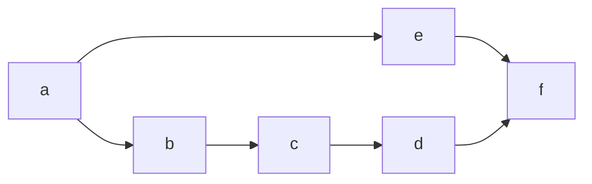

# Chapter 4 — Recursion and transitive closure

Everything in Chapters 1–3 can be expressed, with some pain, using
just a few `SELECT ... JOIN`s and a `UNION` or two. Regular SQL
handles it fine. That changes in this chapter.

Here we let a predicate refer to *itself* in a rule body. This one
move takes us from "Datalog as a tidy front end for joins" to
"Datalog as a general-purpose fixed-point engine" — able to express
transitive closure, reachability, path-finding, and every other
computation whose answer depends on repeatedly applying a step until
nothing new shows up. SQL can do it too, but it requires `WITH
RECURSIVE` and careful anchor/step gymnastics. Datalog just
lets you write it.

## The ancestor example, for real this time

Back in Chapter 0 we teased this. Open
[`code/ch04/ancestor.dl`](code/ch04/ancestor.dl):

```prolog
extensional parent(parent_name: string, child_name: string).

ancestor(X, Y) :- parent(X, Y).
ancestor(X, Y) :- parent(X, Z), ancestor(Z, Y).

?- ancestor("alice", X).
```

Two rules. The first is the **base case**: every parent is an
ancestor. The second is the **recursive step**: a parent of an
ancestor is also an ancestor. The second rule is the one that makes
this recursion, because `ancestor` appears in its body as well as
its head.

Run it:

```bash
bun run datamog doc/walkthrough/code/ch04/ancestor.dl
```

and you'll see Alice has three descendants (`erin`, `helen`, `greg`),
exactly as the family tree from Chapter 2 predicts.

**[Open this program in the playground →](https://max-schaefer.github.io/datamog/#p=parent(%22alice%22%2C%20%22erin%22).%0Aparent(%22bob%22%2C%20%22erin%22).%0Aparent(%22cecil%22%2C%20%22frank%22).%0Aparent(%22diana%22%2C%20%22frank%22).%0Aparent(%22erin%22%2C%20%22greg%22).%0Aparent(%22erin%22%2C%20%22helen%22).%0Aparent(%22frank%22%2C%20%22greg%22).%0Aparent(%22frank%22%2C%20%22helen%22).%0A%23%20Tutorial%2C%20chapter%204%20%E2%80%94%20recursion%20and%20transitive%20closure.%0A%23%0A%23%20The%20canonical%20example.%20Two%20rules%3A%0A%23%0A%23%20%20%20-%20A%20parent%20is%20an%20ancestor%20(base%20case).%0A%23%20%20%20-%20A%20parent%20of%20an%20ancestor%20is%20also%20an%20ancestor%20(recursive%20step).%0A%23%0A%23%20Datalog%20evaluates%20the%20pair%20to%20a%20fixed%20point%2C%20giving%20every%20ancestor%0A%23%20relationship%20reachable%20through%20any%20chain%20of%20%60parent%60%20facts.%0A%0Aancestor(X%2C%20Y)%20%3A-%20parent(X%2C%20Y).%0Aancestor(X%2C%20Y)%20%3A-%20parent(X%2C%20Z)%2C%20ancestor(Z%2C%20Y).%0A%0A%3F-%20ancestor(%22alice%22%2C%20X).%20%20%20%20%20%20%20%20%23%20who%20are%20Alice's%20descendants%3F%0A%3F-%20ancestor(X%2C%20%22greg%22).%20%20%20%20%20%20%20%20%20%23%20who%20are%20Greg's%20ancestors%3F%0A%3F-%20ancestor(%22alice%22%2C%20%22greg%22).%20%20%20%23%20is%20Alice%20an%20ancestor%20of%20Greg%3F%0A%3F-%20ancestor(X%2C%20Y).%20%20%20%20%20%20%20%20%20%20%20%20%20%20%23%20every%20ancestor-descendant%20pair%0A)**

The same rule also answers the backwards question
(`?- ancestor(X, "greg")` → Greg's six ancestors: `erin` and `frank`
through one generation, then `alice`, `bob`, `cecil`, `diana`
through two), the yes/no question (`?- ancestor("alice", "greg")` →
one row confirming it), and the "every pair" question.

### What it's computing, intuitively

Think of the program running in rounds:

- **Round 0.** `ancestor` is empty.
- **Round 1.** The first rule fires. Every `parent(X, Y)` fact
  yields an `ancestor(X, Y)` fact. After this round, `ancestor`
  contains every *one-generation* ancestor relationship.
- **Round 2.** The second rule fires. Every pair `parent(X, Z)` and
  `ancestor(Z, Y)` from round 1 yields `ancestor(X, Y)`. This adds
  every *two-generation* ancestor.
- **Round 3.** Same rules, same procedure. Now we add every
  *three-generation* ancestor — using the two-generation results from
  round 2.
- **Round k.** `ancestor` contains every up-to-*k*-generation
  relationship.
- **Eventually.** No new rows appear. We've found every ancestor
  relationship reachable through any chain of `parent` facts. We
  stop.

This "apply the rules until nothing new appears" procedure is
**naive evaluation**, and it is Datalog's defining move. The same
shape of reasoning covers anything that has a "base case plus a
step". Chapter 5 looks at this procedure in detail; here we just
use it.

## Transitive closure: the same pattern, outside of families

Here's a directed graph:



From [`code/ch04/reach.dl`](code/ch04/reach.dl):

```prolog
extensional edge(src: string, dst: string).

reach(X, Y) :- edge(X, Y).
reach(X, Y) :- edge(X, Z), reach(Z, Y).
```

If you blur your eyes, this is the ancestor program with `parent`
renamed to `edge` and `ancestor` renamed to `reach`. That is not a
coincidence: **the structural pattern "base case + linear recursive
step" is exactly transitive closure**. Every Datalog recursion you
see in this tutorial is a variant of it.

`?- reach("a", Y).` returns `{b, c, d, e, f}` — everything reachable
from `a`. `?- reach(X, "f").` returns `{a, b, c, d, e}` — everything
that can reach `f`.

## A small anatomy of a recursive rule

A well-formed recursive Datalog predicate needs:

1. **A base case.** At least one rule whose body does not refer to
   the predicate. Without one, recursion has nowhere to start and
   the predicate is empty. Datamog detects this case and inserts an
   empty anchor into the generated SQL so you get zero rows rather
   than a malformed query.
2. **A recursive step.** One or more rules whose body mentions the
   predicate. This is where "one more step" gets added.
3. **The step must be linear on every SQL backend.** Each recursive
   body may reference the recursive predicate **at most once** when
   you compile through `sqlite`/`sqljs`/`postgres`: those backends
   reject rules like `tc(X, Z) :- tc(X, Y), tc(Y, Z).` at
   translation time, because the SQL dialects' recursive-CTE
   semantics don't compute a true fixed point for non-linear
   recursion — you'd silently get wrong answers on long chains. The
   pure in-memory `native` and `seminaive` backends *do* handle
   non-linear recursion correctly, so a quadratic transitive closure
   runs there. Chapter 5 walks through the gory details; for now, if
   you catch yourself writing two recursive body atoms and want your
   program portable to a SQL backend, split the recursion by joining
   with an EDB atom instead (as the two examples above do).

## Linear recursion, "forward" and "backward"

A subtle point: the two rules

```prolog
ancestor(X, Y) :- parent(X, Y).
ancestor(X, Y) :- parent(X, Z), ancestor(Z, Y).   # parent + recursion
```

and

```prolog
ancestor(X, Y) :- parent(X, Y).
ancestor(X, Y) :- ancestor(X, Z), parent(Z, Y).   # recursion + parent
```

are **logically equivalent** — both describe the same set of
ancestor relationships. They differ only in iteration style: the
first extends yesterday's ancestors by one *parent step* at the
top; the second at the bottom. In Datamog's SQL compilation, either
form produces the same answers in roughly the same number of
iterations, because set semantics and the recursive CTE's "working
table" do the same bookkeeping either way. You can use whichever
reads more naturally.

If you've written Prolog, the left-recursive second form ought to
ring alarm bells: its first body goal is `ancestor(X, Z)`, so a
top-down SLD interpreter would try to prove it by unfolding the
same rule, recurse into itself, unfold again, and never reach the
base case. Datalog sidesteps this entirely because evaluation is
**bottom-up, not top-down**: Chapter 5 shows that we don't "call"
`ancestor` — we fill it in round by round, starting from what is
derivable in zero steps. Round *k+1* reads round *k*'s rows, which
are already known, so a recursive body atom — left, right, or
middle — just looks up a finite set. There is no stack to blow,
and so no left/right asymmetry.

> **Logic lens.** The meaning of a recursive Datalog program is the
> **least fixed point** of the *immediate-consequence operator*
> `Tₚ`. Given a set `I` of known facts, `Tₚ(I)` is the set of all
> heads that can be derived by firing some rule whose body is
> satisfied in `I`. We iterate:
>
> ```
> I₀ = ∅
> I₁ = Tₚ(I₀)     — every fact derivable in one step from ∅
> I₂ = Tₚ(I₁)     — every fact derivable from I₁ in one step
> ...
> ```
>
> Because rules are monotone (you can only *add* facts, never
> retract), the sequence `I₀ ⊆ I₁ ⊆ I₂ ⊆ ...` is increasing.
> Because the active domain is finite (Chapter 0 footnote: modulo
> arithmetic and string ops), the sequence stabilises — there is a
> smallest `k` with `Iₖ = Iₖ₊₁`. That fixed point is the program's
> answer: the **minimal Herbrand model** of the rules.
>
> This is a deep result and one of Datalog's two great elegances.
> (The other is that the model is *unique* — a property you lose
> the moment you add disjunction inside rule bodies.) Everything in
> Chapter 5, 8, and 9 can be understood as operational tricks for
> computing this same fixed point more efficiently or in the
> presence of negation and aggregation.

> **SQL lens.** Run `--dry-run` on `ancestor.dl`:
>
> ```sql
> CREATE VIEW IF NOT EXISTS "ancestor" AS
>   WITH RECURSIVE "ancestor"(col1, col2) AS (
>     SELECT __b0."parent_name" AS col1, __b0."child_name" AS col2
>     FROM "parent" AS __b0
>     UNION
>     SELECT __b0."parent_name" AS col1, __b1."col2" AS col2
>     FROM "parent" AS __b0, "ancestor" AS __b1
>     WHERE __b0."child_name" = __b1."col1"
>   )
>   SELECT * FROM "ancestor"
> ;
> ```
>
> The shape is exact: the base rule becomes the anchor query (left
> of the `UNION`); the recursive rule becomes the step query (right
> of the `UNION`). SQL's `WITH RECURSIVE` iterates the step until
> no new rows appear, then returns the accumulated result. That is
> exactly naive evaluation translated into SQL. Different backends
> wrap this differently — that's the SQLite/sql.js shape (`WITH
> RECURSIVE` embedded inside a regular `CREATE VIEW`); Postgres uses
> a top-level `CREATE RECURSIVE VIEW "ancestor" (col1, col2) AS (…)`
> with no outer `CREATE VIEW` wrapper. For mutually recursive
> predicates the picture gets more elaborate. See `doc/spec.md` §6.4
> for the full story.

> **Imperative lens.** Finding ancestors in Python looks something
> like this:
>
> ```python
> parent = [
>     ("alice", "erin"), ("bob", "erin"),
>     ("cecil", "frank"), ("diana", "frank"),
>     ("erin", "greg"),   ("erin", "helen"),
>     ("frank", "greg"),  ("frank", "helen"),
> ]
>
> def descendants_of(anc):
>     worklist = [c for (p, c) in parent if p == anc]
>     seen = set()
>     while worklist:
>         x = worklist.pop()
>         if x in seen:
>             continue
>         seen.add(x)
>         worklist.extend(c for (p, c) in parent if p == x)
>     return seen
> ```
>
> Three imperative moves that the Datalog version leaves implicit:
> an explicit **worklist** (which rows to process next), an explicit
> **seen set** (so we don't revisit), and an explicit **termination
> check** (the `while worklist:` loop stops when there's nothing
> left). The Datalog engine does all three for you — and because
> Datalog has set semantics, the "don't re-add seen rows" step is
> free. This is also when direction-independence really starts to
> earn its keep: swap the query to `ancestors_of(descendant)` and
> you'd rewrite the entire loop, iterating through parent-of rather
> than child-of. In Datalog the same rule answers both.

## Recap

- A predicate is **recursive** when at least one of its rules
  references the predicate in its body. The recursive rule must be
  *linear* in Datamog: at most one self-reference per rule body.
- The meaning is the least fixed point of the rules: iterate "one
  more step" until nothing new appears. This always terminates for
  textbook Datalog, and is what unlocks transitive-closure-style
  computations.
- Through the **logic lens**, the answer is the minimal Herbrand
  model. Through the **SQL lens**, it's a `WITH RECURSIVE` CTE with
  the base case as the anchor and the recursive rule as the step.
  Through the **imperative lens**, it's a worklist/seen-set loop
  that the engine writes for you — including the termination check.

## Exercises

### Exercise 4.1 — Reachable within k steps ★

Starter: [`code/ch04/ex1-bounded-reach.dl`](code/ch04/ex1-bounded-reach.dl)

Define `reach_in(K, X, Y)` — "`Y` is reachable from `X` in at
most `K` edges" — for `K` ranging over some small set, say
`K ∈ {1, 2, 3}`. You'll need three non-recursive rules rather
than one recursive one. What's the tradeoff between this form and
recursive `reach`? (Hint: think about programs and data domains
where `K` is bounded in advance.)

### Exercise 4.2 — Reflexive transitive closure ★

Starter: [`code/ch04/ex2-reflexive.dl`](code/ch04/ex2-reflexive.dl)

Define `reach_or_self(X, Y)` — "`Y` is reachable from `X`, **or**
`X = Y`". You'll need a third rule for reflexivity. Where can
"reflexive" rows come from? The program as written has no
`self_loop` fact; what value should a reflexive base case read
from?

### Exercise 4.3 — Non-linear is rejected ★★

Starter: [`code/ch04/ex3-nonlinear.dl`](code/ch04/ex3-nonlinear.dl)

The "textbook" transitive closure uses two recursive body atoms:

```prolog
tc(X, Z) :- edge(X, Y), tc(Y, Z).       # linear — accepted
tc(X, Z) :- tc(X, Y), tc(Y, Z).         # non-linear — rejected
```

Enable both rules in the starter and try to run it under a SQL
backend (`--backend sqlite` or `--backend postgres`). Write down
the error Datamog produces. Then run the same program under
`--backend seminaive`: the in-memory evaluator accepts the
quadratic formulation and returns the correct closure. Finally,
read the long comment at the top of
`packages/cli/examples/transitive-closure/transitive-closure.dl` —
it's one of the best explanations around of *why* SQL's recursive
CTE semantics can't compute the full closure when both rules are
active, and why a true seminaive implementation can.

### Exercise 4.4 — Mutual recursion ★★★

Starter: [`code/ch04/ex4-mutual/`](code/ch04/ex4-mutual/)

Given a graph with coloured edges, define two predicates that
alternate colours:

```prolog
extensional edge(src: string, dst: string, colour: string).

# rr = reachable ending on a red step
rr(X, Y) :- edge(X, Y, "red").
rr(X, Y) :- bb(X, Z), edge(Z, Y, "red").

# bb = reachable ending on a blue step
bb(X, Y) :- edge(X, Y, "blue").
bb(X, Y) :- rr(X, Z), edge(Z, Y, "blue").
```

Run it under any SQL backend. Compare the `--dry-run` output on
`sqlite`/`sqljs` (one combined CTE discriminated by a `__tag`
column — a workaround SQLite's `WITH RECURSIVE` requires because it
doesn't support multiple recursive CTEs in one block) and on
`postgres` (two sibling CTEs in a single `WITH RECURSIVE`,
structurally cleaner but only available where the engine supports
it). Predict what happens if you swap the order of `rr` and `bb`
definitions; then try it.

### Exercise 4.5 — Same-generation ★★★

Starter: [`code/ch04/ex5-samegen.dl`](code/ch04/ex5-samegen.dl)

The classic "same generation" predicate: two people are
same-generation if they share a common ancestor at equal depth.
Write it *recursively* — without referring to generation numbers.
You'll need a base case (siblings are same-generation) and a
recursive step (two descendants of same-generation ancestors are
themselves same-generation). Watch out: your naive rule will
include self-pairs `(X, X)`; we don't yet have inequality, so
that's acceptable for now. We'll tighten it up in Chapter 7.

---

Next: **[Chapter 5 — How Datalog runs: naive and seminaive evaluation](05-evaluation.md)**.
Having seen recursion in action, we'll open up the engine and look at exactly
how it computes the fixed point. We'll also meet Datamog's two pure-Datalog
backends (`native` and `seminaive`) and use them to visualise the iteration
step by step.
